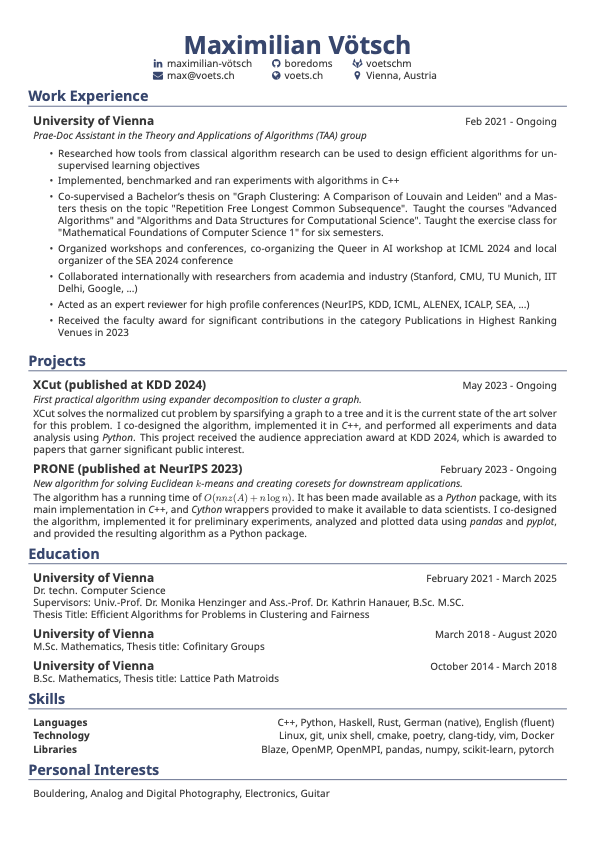

# Resume Template

This is a resume template written in LaTeX, based on the work of Andrew Li. It has been heavily modified from the original, to make it more convenient and to add additional features, such as the creation of multilingual CVs and the introduction of a more involved build system. To build the project you need to have a `texlive` distribution and `latexmk` installed.

## Multilingual 
To add a new language you need to add a new makefile goal, a resume-xx.tex file and the relevant macros in the main tex file. This way of working ensures that updates are more likely to propagate to all possible languages and save you any headaches later.

There are also a number of different header styles, as the original style was using a lot of whitespace.

## Preview

## Recommendations

Andrew Li says: "Please do not use Overleaf". I agree. Also, as of a few days ago (time of writing: 2024-01-16) they made their editor worse. Yet again.

## License

MIT